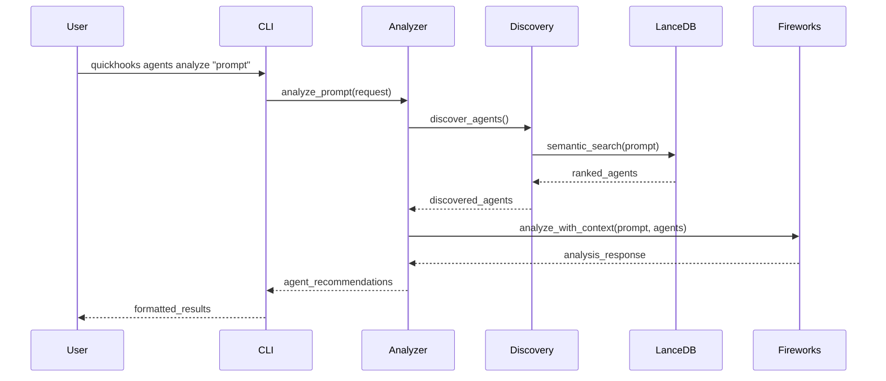
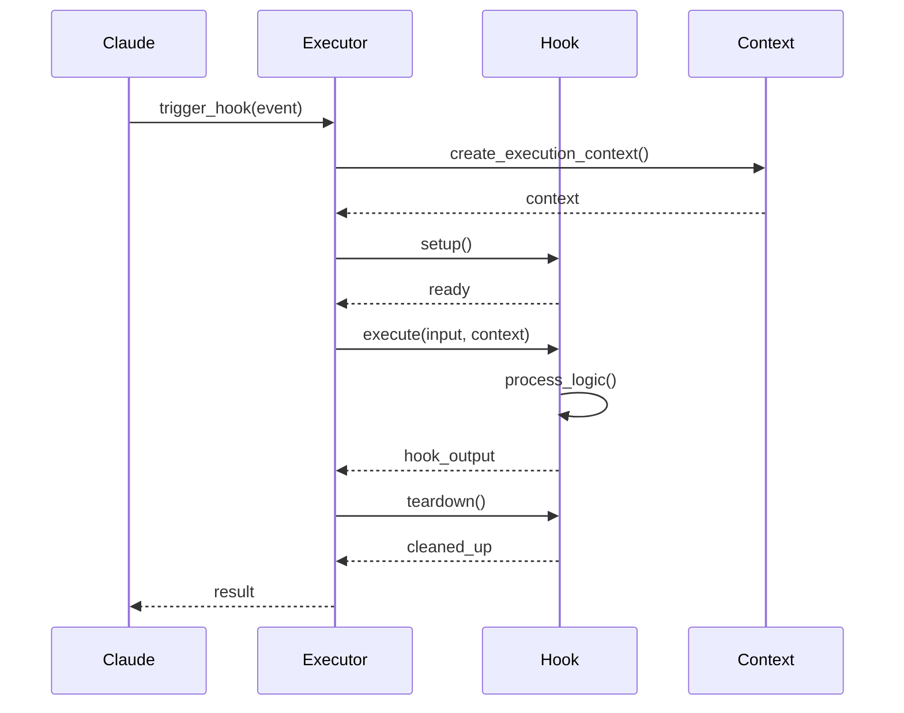
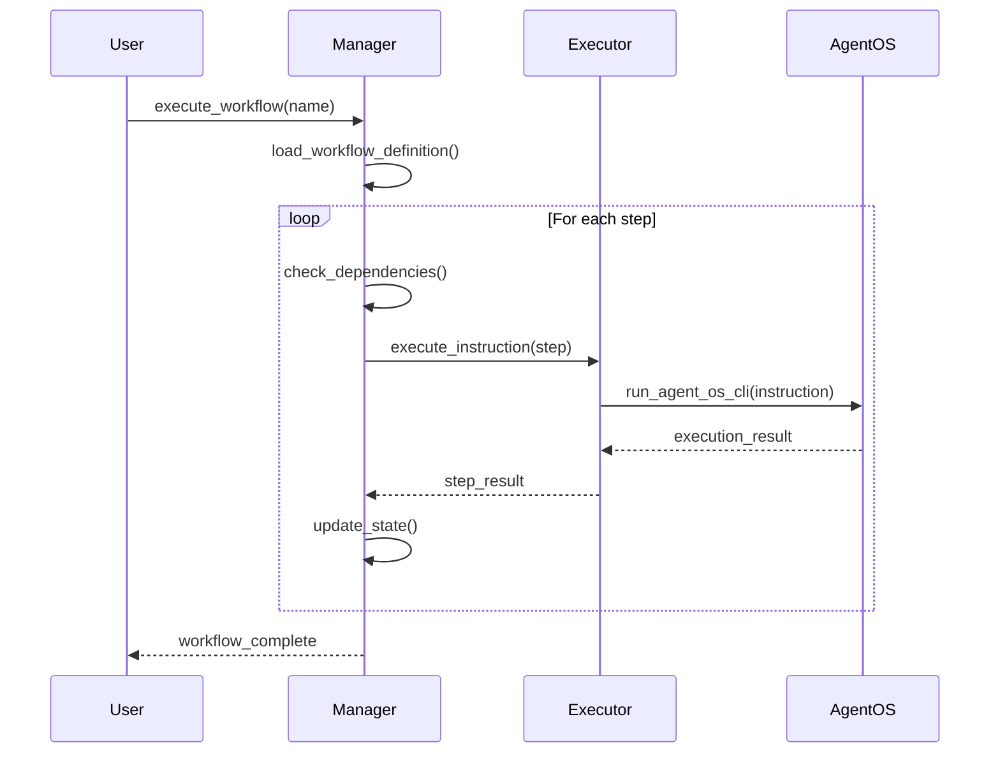

# System Architecture & Design

## Architectural Overview

QuickHooks follows a **layered architecture** pattern with clear separation of concerns, designed for extensibility, testability, and maintainability. The system consists of five primary layers working together to provide a comprehensive TDD framework for Claude Code hooks.

```
┌─────────────────────────────────────────────────────────┐
│                    CLI Layer                             │
│  (User Commands, Rich Output, Argument Parsing)          │
└───────────────────┬─────────────────────────────────────┘
                    │
┌───────────────────▼─────────────────────────────────────┐
│               Feature Modules Layer                       │
│  ┌──────────────┐ ┌──────────────┐ ┌──────────────┐     │
│  │Agent Analysis│ │  Agent OS    │ │Claude Code   │     │
│  │              │ │  Integration │ │  Manager     │     │
│  └──────────────┘ └──────────────┘ └──────────────┘     │
└───────────────────┬─────────────────────────────────────┘
                    │
┌───────────────────▼─────────────────────────────────────┐
│                  Core Framework                          │
│  ┌──────────────┐ ┌──────────────┐ ┌──────────────┐     │
│  │  Hook Base   │ │  Executor    │ │  Processor   │     │
│  │  Classes     │ │              │ │              │     │
│  └──────────────┘ └──────────────┘ └──────────────┘     │
└───────────────────┬─────────────────────────────────────┘
                    │
┌───────────────────▼─────────────────────────────────────┐
│              Infrastructure Layer                        │
│  ┌──────────────┐ ┌──────────────┐ ┌──────────────┐     │
│  │  Database    │ │  Config      │ │ Visualization│     │
│  │  (LanceDB)   │ │  Management  │ │  (Mermaid)   │     │
│  └──────────────┘ └──────────────┘ └──────────────┘     │
└───────────────────┬─────────────────────────────────────┘
                    │
┌───────────────────▼─────────────────────────────────────┐
│              External Services                           │
│  ┌──────────────┐ ┌──────────────┐ ┌──────────────┐     │
│  │  Fireworks   │ │  Agent OS    │ │  Claude Code │     │
│  │  AI API      │ │  Runtime     │ │  Runtime     │     │
│  └──────────────┘ └──────────────┘ └──────────────┘     │
└─────────────────────────────────────────────────────────┘
```

### Architectural Principles

1. **Separation of Concerns**: Each layer has well-defined responsibilities
2. **Dependency Inversion**: High-level modules don't depend on low-level modules
3. **Interface Segregation**: Abstract base classes define clear contracts
4. **Single Responsibility**: Each module has one primary purpose
5. **Open/Closed**: Open for extension via plugins, closed for modification

## Directory Structure

```
quickhooks/
├── src/quickhooks/              # Main package source code
│   ├── __init__.py              # Package initialization and exports
│   ├── __main__.py              # Entry point for python -m quickhooks
│   ├── dev.py                   # Hot-reload development server
│   ├── executor.py              # Hook execution engine
│   ├── runner.py                # Test runner infrastructure
│   ├── config.py                # Configuration management
│   ├── models.py                # Core data models (Pydantic)
│   ├── exceptions.py            # Custom exception hierarchy
│   ├── features.py              # Feature flag management
│   │
│   ├── cli/                     # Command-line interface
│   │   ├── __init__.py
│   │   ├── main.py              # Root CLI app (Cyclopts)
│   │   ├── agents.py            # Agent analysis commands
│   │   ├── agent_os.py          # Agent OS integration commands
│   │   ├── create.py            # Hook/config creation commands
│   │   ├── deploy.py            # Deployment commands
│   │   ├── features.py          # Feature management commands
│   │   ├── global_hooks.py      # Global hook management
│   │   ├── install.py           # Installation commands
│   │   ├── scaffold.py          # Template scaffolding
│   │   ├── settings.py          # Settings management
│   │   └── smart.py             # Smart generation features
│   │
│   ├── core/                    # Core framework components
│   │   ├── __init__.py
│   │   └── processor.py         # Parallel processing engine
│   │
│   ├── hooks/                   # Hook base classes and utilities
│   │   ├── __init__.py
│   │   ├── base.py              # Abstract BaseHook class
│   │   └── parallel.py          # Parallel execution patterns
│   │
│   ├── agent_analysis/          # AI-powered agent analysis
│   │   ├── __init__.py
│   │   ├── analyzer.py          # Core analysis engine (Pydantic AI)
│   │   ├── agent_discovery.py   # Local agent discovery (LanceDB)
│   │   ├── context_manager.py   # Context chunking for large inputs
│   │   ├── command.py           # CLI commands for analysis
│   │   └── types.py             # Type definitions for analysis
│   │
│   ├── agent_os/                # Agent OS integration
│   │   ├── __init__.py
│   │   ├── executor.py          # Agent OS instruction executor
│   │   ├── instruction_parser.py # Instruction file parser
│   │   ├── workflow_manager.py  # Multi-step workflow orchestration
│   │   └── hooks.py             # Pre/post-execution hooks
│   │
│   ├── claude_code/             # Claude Code integration
│   │   ├── __init__.py
│   │   ├── manager.py           # Claude Code settings manager
│   │   └── models.py            # Claude Code data models
│   │
│   ├── db/                      # Database management
│   │   ├── __init__.py
│   │   ├── manager.py           # Database connection manager
│   │   ├── indexer.py           # Agent indexing and search
│   │   └── models.py            # Database schemas
│   │
│   ├── schema/                  # JSON schema validation
│   │   ├── __init__.py
│   │   ├── validator.py         # Schema validators
│   │   └── models.py            # Schema definitions
│   │
│   ├── utils/                   # Shared utilities
│   │   ├── __init__.py
│   │   └── jinja_utils.py       # Template rendering utilities
│   │
│   └── visualization/           # Visualization components
│       ├── __init__.py
│       └── mermaid_generator.py # Mermaid diagram generation
│
├── hooks/                       # Example hook implementations
│   ├── agent_analysis_hook.py   # Agent analysis integration hook
│   ├── agent_os_workflow_hook.py # Agent OS workflow hook
│   ├── example_hook.py          # Basic example hook
│   ├── intelligent_tool_dispatcher.py # Smart tool routing
│   └── language_aware_*.py      # Language-specific hooks
│
├── templates/                   # Jinja2 templates for code generation
│   ├── hook_class.py.j2         # Hook class template
│   ├── cli_command.py.j2        # CLI command template
│   ├── smart_hook.py.j2         # Smart hook template
│   └── hooks/                   # Hook-specific templates
│
├── examples/                    # Example code and configurations
│   ├── agent_os_demo.py         # Agent OS integration demo
│   ├── jinja_demo.py            # Template rendering demo
│   └── config_examples/         # Sample configuration files
│
├── tests/                       # Comprehensive test suite
│   ├── conftest.py              # Pytest configuration and fixtures
│   ├── test_*.py                # Unit tests
│   ├── integration/             # Integration tests
│   │   ├── test_fireworks_integration.py
│   │   └── test_fireworks_provider.py
│   └── hooks_test/              # Hook-specific tests
│
├── scripts/                     # Development and deployment scripts
│   ├── agent-coordinator.py     # Agent coordination utilities
│   ├── create-hook.py           # Hook creation script
│   ├── deploy.py                # Deployment automation
│   ├── semver-automation.py     # Version management
│   ├── setup_claude_code_integration.py # Claude Code setup
│   ├── setup_pep723_hooks.py    # PEP 723 hook installation
│   └── validate-build.py        # Build validation
│
├── docs/                        # Documentation
│   ├── README.md                # Documentation index
│   ├── getting-started.md       # Quick start guide
│   ├── uv-guide.md              # UV package manager guide
│   ├── deployment.md            # Deployment guide
│   ├── agent-os-integration.md  # Agent OS documentation
│   ├── guides/                  # Detailed guides
│   ├── architecture/            # Architecture documentation
│   ├── workflows/               # Workflow diagrams
│   └── development/             # Development documentation
│
├── .claude/                     # Claude Code integration
│   ├── agents/                  # Agent definitions
│   ├── commands/                # Custom commands
│   ├── hooks/                   # Installed hooks
│   ├── skills/                  # Claude skills
│   └── settings.json            # Claude Code settings
│
├── .moai/                       # MoAI-ADK integration
│   ├── config.json              # Project configuration
│   └── project/                 # Project documentation
│       ├── product.md           # This document's companion
│       ├── structure.md         # This document
│       └── tech.md              # Technical documentation
│
├── pyproject.toml               # Project metadata and dependencies
├── uv.lock                      # UV dependency lock file
├── Makefile                     # Development workflow shortcuts
├── ruff.toml                    # Ruff linter configuration
├── README.md                    # Project overview
└── CLAUDE.md                    # Claude Code project standards
```

## Core Modules

### 1. CLI Layer (`src/quickhooks/cli/`)

**Purpose**: Provide intuitive command-line interface for all QuickHooks functionality

**Key Components**:
- **main.py**: Root Cyclopts application with grouped subcommands
- **agents.py**: Agent analysis CLI (`quickhooks agents analyze`)
- **agent_os.py**: Agent OS workflow CLI (`quickhooks agent-os execute-instruction`)
- **create.py**: Template generation CLI (`quickhooks create hook`)
- **install.py**: Hook installation and validation
- **features.py**: Feature flag management

**Design Patterns**:
- Command pattern for extensible CLI structure
- Builder pattern for complex command configurations
- Dependency injection for testability

**Integration Points**:
- Calls feature modules for business logic
- Uses Rich console for formatted output
- Integrates with Cyclopts for argument parsing

### 2. Agent Analysis Module (`src/quickhooks/agent_analysis/`)

**Purpose**: AI-powered analysis to recommend appropriate agents for user prompts

**Key Components**:
- **analyzer.py**: Core Pydantic AI integration with Fireworks provider
- **agent_discovery.py**: Local agent discovery using LanceDB vector database
- **context_manager.py**: Intelligent chunking for large context (128K tokens)
- **types.py**: Type definitions (AgentAnalysisRequest, AgentAnalysisResponse, etc.)

**Data Flow**:
```
User Prompt → Context Manager (chunk if needed)
           → Agent Discovery (find local agents)
           → Analyzer (AI analysis via Pydantic AI)
           → Response (ranked agents with confidence scores)
```

**Design Decisions**:
- **Pydantic AI**: Type-safe AI interactions with structured outputs
- **Fireworks Provider**: Cost-effective, fast inference
- **LanceDB**: Serverless vector DB for agent embeddings
- **FastEmbed**: Lightweight embeddings without heavy dependencies

### 3. Agent OS Integration (`src/quickhooks/agent_os/`)

**Purpose**: Execute Agent OS instructions and manage multi-step workflows

**Key Components**:
- **executor.py**: Runs individual Agent OS instructions
- **instruction_parser.py**: Parses instruction files (YAML/JSON)
- **workflow_manager.py**: Orchestrates multi-step workflows with state
- **hooks.py**: Pre/post-execution hook system

**Workflow State Management**:
```python
WorkflowState:
  - workflow_name: str
  - current_step: str | None
  - completed_steps: list[str]
  - failed_steps: list[str]
  - step_results: dict[str, Any]
  - context: dict[str, Any]
  - status: "pending" | "running" | "completed" | "failed"
```

**Design Decisions**:
- **State Persistence**: Workflows can be paused and resumed
- **Dependency Management**: Steps can depend on previous step results
- **Error Handling**: Failed steps don't crash entire workflow
- **Context Propagation**: Results flow between steps

### 4. Hook Framework (`src/quickhooks/hooks/`)

**Purpose**: Provide abstract base classes for hook development

**Class Hierarchy**:
```
BaseHook (ABC)
├── ParallelHook (parallel execution)
├── PipelineHook (sequential processing)
└── DataParallelHook (data-level parallelism)
```

**BaseHook Interface**:
```python
class BaseHook(ABC):
    @abstractmethod
    async def execute(
        self,
        input_data: HookInput,
        context: ExecutionContext
    ) -> HookOutput:
        """Execute the hook logic"""
        pass

    def validate(self, input_data: HookInput) -> bool:
        """Validate input before execution"""
        pass

    async def setup(self) -> None:
        """Initialize resources"""
        pass

    async def teardown(self) -> None:
        """Clean up resources"""
        pass
```

**Design Patterns**:
- Template method for hook lifecycle
- Strategy pattern for execution modes
- Observer pattern for hook events

### 5. Core Framework (`src/quickhooks/core/`)

**Purpose**: Provide fundamental execution and processing capabilities

**Key Components**:
- **processor.py**: ParallelProcessor for concurrent hook execution
- **executor.py**: HookExecutor for managing hook lifecycle
- **models.py**: Core data models (ExecutionContext, HookResult, etc.)

**Parallel Processing**:
```python
class ParallelProcessor:
    async def process_batch(
        self,
        tasks: list[ProcessingTask],
        mode: ProcessingMode = ProcessingMode.PARALLEL,
        max_concurrency: int = 10,
    ) -> list[ProcessingResult]:
        """Process tasks with configurable parallelism"""
        pass
```

**Execution Modes**:
- **PARALLEL**: All tasks execute concurrently
- **SEQUENTIAL**: Tasks execute one after another
- **PRIORITY**: Tasks execute by priority order
- **ADAPTIVE**: Dynamically adjust concurrency based on load

### 6. Database Layer (`src/quickhooks/db/`)

**Purpose**: Manage agent embeddings and semantic search

**Key Components**:
- **manager.py**: LanceDB connection and lifecycle management
- **indexer.py**: Agent indexing and similarity search
- **models.py**: Database schemas (AgentRecord, EmbeddingRecord)

**Vector Search Pipeline**:
```
Agent Files (Python/Markdown/JSON)
→ Extract agent metadata (name, description, capabilities)
→ Generate embeddings (FastEmbed)
→ Store in LanceDB
→ Query by semantic similarity
→ Return ranked results with confidence scores
```

**Design Decisions**:
- **LanceDB**: Serverless, no separate process required
- **FastEmbed**: Fast, lightweight embedding generation
- **Automatic Indexing**: Scans `~/.claude/agents` on startup
- **Incremental Updates**: Only re-index changed agents

### 7. Visualization (`src/quickhooks/visualization/`)

**Purpose**: Generate workflow diagrams and visual documentation

**Key Components**:
- **mermaid_generator.py**: Generate Mermaid diagrams from workflow definitions

**Supported Diagram Types**:
- Workflow flowcharts
- Hook execution sequences
- Agent relationship graphs
- System architecture diagrams

## External System Integration

### Fireworks AI Integration

**Purpose**: Provide AI inference for agent analysis

**Integration Points**:
- Pydantic AI agent for structured outputs
- FireworksProvider for API communication
- Environment variable configuration (`FIREWORKS_API_KEY`)

**API Flow**:
```
QuickHooks → Pydantic AI Agent
          → FireworksProvider
          → Fireworks API (HTTPS)
          → Structured Response (AgentAnalysisResponse)
```

**Error Handling**:
- Retry with exponential backoff
- Fallback to cached results if available
- Clear error messages for API failures

### Agent OS Integration

**Purpose**: Execute Agent OS instructions and workflows

**Integration Points**:
- Instruction file parsing (YAML/JSON)
- Command execution via subprocess
- State persistence to local files
- Pre/post-execution hooks

**Execution Flow**:
```
Instruction File → Parser → Executor
                          → Pre-hooks
                          → Agent OS CLI
                          → Post-hooks
                          → State Update
```

**Design Decisions**:
- **Subprocess Isolation**: Each instruction runs in isolated process
- **Environment Propagation**: Environment variables passed through
- **Working Directory**: Configurable per-instruction
- **Timeout Management**: Configurable timeouts to prevent hangs

### Claude Code Integration

**Purpose**: Integrate hooks into Claude Code workflow

**Integration Points**:
- `.claude/settings.json` configuration
- Pre-tool-use and post-tool-use hooks
- Custom commands registration
- Agent definitions

**Hook Execution Flow**:
```
Claude Code Event → Hook Trigger
                  → QuickHooks Executor
                  → Hook Logic
                  → Result Processing
                  → Claude Code Continuation
```

**Configuration Management**:
- Automatic settings validation
- Hook enable/disable toggle
- Environment variable injection
- Verbose logging support

## Data Flow & API Design

### Agent Analysis Data Flow



### Hook Execution Data Flow



### Workflow Execution Data Flow



## Architecture Decisions & Rationale

### Decision 1: UV Build Backend

**Context**: Need fast, reliable dependency management for Python 3.12+ project

**Options Considered**:
- Poetry: Popular but slow dependency resolution
- pip-tools: Manual, lacks modern features
- UV: Fast (10-100x), modern, Rust-based

**Decision**: Use UV as primary build backend

**Rationale**:
- 10-100x faster dependency resolution than pip
- PEP 723 support for self-contained scripts
- Modern Python project standards (PEP 735, etc.)
- Active development by Astral (Ruff creators)

**Consequences**:
- ✅ Significantly faster CI/CD pipelines
- ✅ Better developer experience
- ⚠️ Requires UV installation (one-time setup)
- ⚠️ Less familiar to some Python developers

### Decision 2: Pydantic AI for Agent Analysis

**Context**: Need type-safe, structured AI interactions for agent recommendations

**Options Considered**:
- Direct OpenAI SDK: Low-level, verbose
- LangChain: Heavy, complex abstractions
- Instructor: Good but limited providers
- Pydantic AI: Type-safe, multi-provider

**Decision**: Use Pydantic AI with Fireworks provider

**Rationale**:
- Type-safe structured outputs via Pydantic
- Multi-provider support (easy to swap)
- Lightweight, minimal dependencies
- Excellent error handling and validation

**Consequences**:
- ✅ Type safety throughout AI pipeline
- ✅ Easy provider switching
- ✅ Automatic validation of AI responses
- ⚠️ Newer library (less community resources)

### Decision 3: LanceDB for Agent Discovery

**Context**: Need vector database for semantic agent search

**Options Considered**:
- Chroma: Popular but requires server
- Pinecone: Cloud-based, costs money
- FAISS: Low-level, no metadata support
- LanceDB: Serverless, embedded

**Decision**: Use LanceDB with FastEmbed

**Rationale**:
- Serverless (no separate process)
- Embedded in Python process
- Good performance for <10K agents
- Simple API, minimal setup

**Consequences**:
- ✅ Zero infrastructure required
- ✅ Fast startup time
- ✅ Simple deployment
- ⚠️ Not suitable for millions of agents (not a concern)

### Decision 4: Cyclopts for CLI

**Context**: Need modern, type-safe CLI framework

**Options Considered**:
- Typer: Popular but has type checking issues
- Click: Low-level, verbose decorators
- Argparse: Standard library but basic
- Cyclopts: Modern, type-safe, clean API

**Decision**: Migrate from Typer to Cyclopts

**Rationale**:
- Better type safety with mypy
- Cleaner API than Typer
- Better support for complex command groups
- Active development and support

**Consequences**:
- ✅ Full mypy compliance
- ✅ Better developer experience
- ✅ Cleaner codebase
- ⚠️ Migration effort from Typer (completed)

### Decision 5: Async-First Architecture

**Context**: Need to handle concurrent operations efficiently

**Options Considered**:
- Sync-only: Simple but limited
- Threading: GIL limitations in Python
- Multiprocessing: Heavy, complex
- Async/await: Native, efficient

**Decision**: Use async/await throughout codebase

**Rationale**:
- Native Python async/await support
- Efficient for I/O-bound operations (AI API calls)
- Easy to reason about with modern Python
- Good library ecosystem (anyio, asyncio)

**Consequences**:
- ✅ Better performance for I/O operations
- ✅ Scalable architecture
- ⚠️ Slightly more complex code
- ⚠️ Requires async libraries

## Non-Functional Requirements

### Performance

**Targets**:
- Agent analysis: <2 seconds for typical prompts
- Hot reload: <1 second for code changes
- Hook execution overhead: <100ms per hook
- Vector search: <500ms for 1,000 agents
- Workflow execution: <10s for 10-step workflow

**Monitoring**:
- Execution time tracking per hook
- API latency monitoring (Fireworks)
- Database query performance metrics
- Memory usage profiling

### Scalability

**Current Scale**:
- Supports up to 10,000 local agents
- Concurrent execution of up to 100 hooks
- Workflow state up to 1GB
- Context size up to 128K tokens

**Design for Scale**:
- Stateless hook execution (horizontal scaling)
- Efficient vector search with LanceDB
- Batched AI API calls when possible
- Resource pooling for database connections

### Reliability

**Availability**:
- Graceful degradation when AI API unavailable
- Fallback to cached agent recommendations
- Automatic retry with exponential backoff
- Clear error messages and logging

**Data Integrity**:
- Workflow state persistence to disk
- Atomic state updates
- Validation of all inputs and outputs
- Comprehensive error handling

### Security

**API Key Management**:
- Environment variable storage only
- No hardcoded secrets
- Clear warnings when API key missing
- Support for `.env` files

**Code Execution**:
- Sandboxed hook execution (via async)
- Input validation for all commands
- Safe template rendering (Jinja2)
- Dependency security audits

### Observability

**Logging**:
- Structured logging via Python logging module
- Configurable log levels (DEBUG, INFO, WARNING, ERROR)
- Rich console output for user-facing logs
- File logging for debugging

**Metrics**:
- Execution time per operation
- Success/failure rates
- API call counts and latencies
- Resource usage (memory, CPU)

**Tracing**:
- Hook execution traces
- Workflow step progression
- AI API request/response logging (with privacy controls)

---

**Document Version**: 1.0
**Last Updated**: 2025-01-08
**Owner**: @user
**Status**: Active Development
