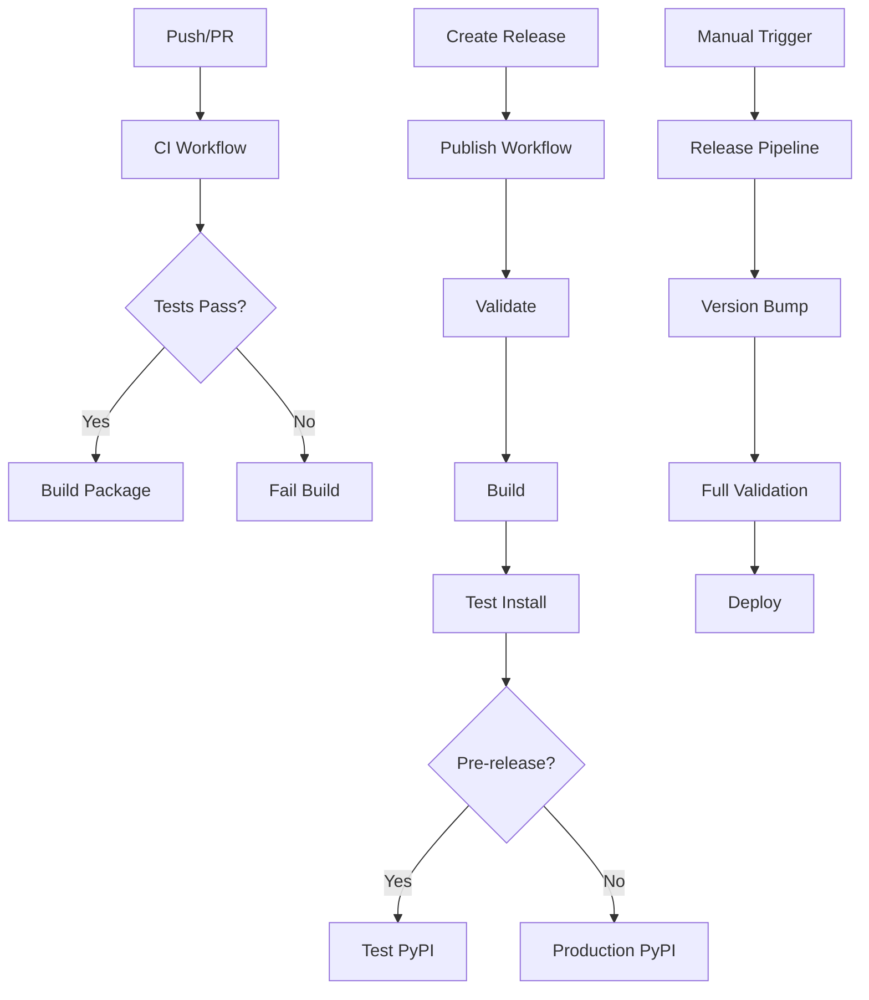

# Publishing Guide for QuickHooks

This guide explains how to publish QuickHooks to PyPI using GitHub Actions, manage versions, and run tests.

## Table of Contents

- [Overview](#overview)
- [Version Management](#version-management)
- [Running Tests](#running-tests)
- [Publishing to PyPI](#publishing-to-pypi)
- [GitHub Actions Workflows](#github-actions-workflows)
- [Manual Publishing](#manual-publishing)

## Overview

QuickHooks uses a comprehensive CI/CD setup with GitHub Actions to automate testing, building, and publishing. The workflows are designed to:

- Run tests on every push and pull request
- Build packages with validation
- Publish to PyPI on releases
- Support both Test PyPI and production PyPI

## Version Management

### Automated Version Bumping

Use the `scripts/bump_version.py` utility to manage versions:

```bash
# Get current version
uv run python scripts/bump_version.py get

# Bump patch version (0.1.1 -> 0.1.2)
uv run python scripts/bump_version.py bump patch

# Bump minor version (0.1.1 -> 0.2.0)
uv run python scripts/bump_version.py bump minor

# Bump major version (0.1.1 -> 1.0.0)
uv run python scripts/bump_version.py bump major

# Set specific version
uv run python scripts/bump_version.py set-version 1.2.3
```

The script automatically updates:
- `pyproject.toml` - Project version
- `src/quickhooks/__init__.py` - Package `__version__` attribute

### Version Bumping via GitHub Actions

You can also bump versions automatically via the Release workflow:

```bash
# Trigger via GitHub Actions UI
# Go to Actions -> Release Pipeline -> Run workflow
# Select version bump type: patch, minor, or major
```

## Running Tests

### Local Testing

```bash
# Run all tests
uv run pytest tests/ -v

# Run tests with coverage
uv run pytest tests/ -v --cov=src/quickhooks --cov-report=html

# Run specific test file
uv run pytest tests/test_agent_analysis.py -v

# Run tests matching a pattern
uv run pytest tests/ -k "test_agent" -v
```

### Test Quality Checks

```bash
# Run linting
uv run ruff check src/ tests/

# Run formatting check
uv run ruff format --check src/ tests/

# Run type checking
uv run mypy src/quickhooks

# Run all quality checks
make check  # or manually run all above commands
```

### CI/CD Testing

Tests run automatically on:
- Every push to `main` or `develop` branches
- Every pull request
- Before any release or publish

The CI runs tests on:
- Multiple OS: Ubuntu, Windows, macOS
- Multiple Python versions: 3.11, 3.12, 3.13
- With coverage reporting to Codecov

## Publishing to PyPI

### Prerequisites

1. **PyPI Account**: Create accounts on [PyPI](https://pypi.org) and [Test PyPI](https://test.pypi.org)
2. **Trusted Publishing**: Configure trusted publishing in PyPI (recommended)
   - Go to PyPI Account Settings
   - Add a new "Pending Publisher"
   - Set workflow: `publish.yml`
   - Set environment: `pypi`

### Publishing Methods

#### Method 1: Automated via GitHub Release (Recommended)

1. Create and push a git tag:
   ```bash
   git tag v0.1.2
   git push origin v0.1.2
   ```

2. Create a GitHub Release:
   - Go to GitHub Releases
   - Click "Draft a new release"
   - Choose your tag
   - Write release notes
   - Click "Publish release"

3. The `publish.yml` workflow will automatically:
   - Run all tests
   - Build packages
   - Validate builds
   - Publish to PyPI

#### Method 2: Manual Workflow Dispatch

1. Go to GitHub Actions
2. Select "Publish to PyPI" workflow
3. Click "Run workflow"
4. Choose options:
   - `test_pypi`: true for Test PyPI, false for production PyPI

#### Method 3: Using Release Pipeline Workflow

1. Go to GitHub Actions
2. Select "QuickHooks Release Pipeline" workflow
3. Click "Run workflow"
4. Configure:
   - Environment: `staging` or `production`
   - Version bump: `patch`, `minor`, or `major` (optional)
   - Publish to PyPI: check if you want to publish

### Publishing to Test PyPI First

Always test your package on Test PyPI before publishing to production:

```bash
# Using the Release workflow
# Set environment to "staging" to publish to Test PyPI

# Install from Test PyPI to verify
pip install --index-url https://test.pypi.org/simple/ quickhooks
```

## GitHub Actions Workflows

### CI Workflow (`ci.yml`)

**Triggers**: Push to main/develop, Pull Requests

**Jobs**:
- **Lint**: Ruff linting and formatting checks
- **Type Check**: MyPy type validation
- **Test**: Run tests on multiple OS and Python versions
- **Security**: Safety and Bandit security scans
- **Build**: Build packages and validate
- **Integration**: Integration tests (main branch only)
- **Performance**: Performance benchmarks (main branch only)

### Publish Workflow (`publish.yml`)

**Triggers**: GitHub Release, Manual workflow dispatch

**Jobs**:
- **Validate Release**: Run all tests and checks
- **Build Package**: Build wheel and source distributions
- **Test Install**: Test installation on multiple platforms
- **Publish Test PyPI**: Publish to Test PyPI (for pre-releases)
- **Publish PyPI**: Publish to production PyPI
- **Post-Publish**: Update release notes with install instructions

**Environment Variables Required**:
- `CODECOV_TOKEN`: For coverage uploads (optional)

### Release Pipeline Workflow (`release.yml`)

**Triggers**: Git tags (v*), GitHub Releases, Manual workflow dispatch

**Jobs**:
- **Validate**: Project structure and version validation
- **Test**: Comprehensive testing on all platforms
- **Security**: Security audits
- **Build**: Package building with agent coordination
- **Integration Test**: Post-build integration testing
- **Deploy**: Publishing to PyPI with environment selection
- **Post-Deploy**: Verification and status updates
- **Cleanup**: Artifact cleanup and notifications

**Manual Workflow Inputs**:
- `environment`: staging or production
- `version_bump`: patch, minor, or major
- `publish_to_pypi`: boolean

## Manual Publishing

If you need to publish manually without GitHub Actions:

```bash
# 1. Bump version
uv run python scripts/bump_version.py bump patch

# 2. Build packages
uv build

# 3. Validate build
uv run python scripts/validate-build.py validate --verbose

# 4. Publish to Test PyPI
uv publish --index testpypi

# 5. Test installation from Test PyPI
pip install --index-url https://test.pypi.org/simple/ quickhooks

# 6. If everything works, publish to PyPI
uv publish
```

**Note**: You'll need to configure PyPI tokens:
```bash
# Set PyPI token
export UV_PUBLISH_TOKEN="your-pypi-token"

# Or for Test PyPI
export UV_PUBLISH_TOKEN_TESTPYPI="your-test-pypi-token"
```

## Build Validation

The `scripts/validate-build.py` script performs comprehensive validation:

```bash
# Run full validation
uv run python scripts/validate-build.py validate --verbose

# Generate checksums
uv run python scripts/validate-build.py checksum --algorithm sha256

# Validation checks:
# - Package metadata consistency
# - Import structure validation
# - Security scanning
# - Size limits
# - Installation testing
```

## Deployment Script

For advanced deployment with parallel agents:

```bash
# Deploy to development
uv run python scripts/deploy.py deploy --env dev

# Deploy to production with version bump
uv run python scripts/deploy.py deploy --env prod --version patch --publish

# Check deployment status
uv run python scripts/deploy.py status

# Dry run (see what would happen)
uv run python scripts/deploy.py deploy --env prod --dry-run
```

## Best Practices

1. **Always Test First**: Use Test PyPI before publishing to production
2. **Version Properly**: Follow semantic versioning (MAJOR.MINOR.PATCH)
3. **Write Changelogs**: Document changes in release notes
4. **Tag Releases**: Use git tags matching the version (v0.1.2)
5. **Run Local Tests**: Ensure tests pass locally before pushing
6. **Check Coverage**: Maintain >80% code coverage
7. **Security Scan**: Review security reports before releases

## Troubleshooting

### Tests Fail in CI

```bash
# Run the same tests locally
uv run pytest tests/ -v --cov=src/quickhooks

# Check specific platform issues
# (tests run on Ubuntu, Windows, macOS in CI)
```

### Build Validation Fails

```bash
# Run validation locally
uv run python scripts/validate-build.py validate --verbose

# Common issues:
# - Version mismatch between pyproject.toml and __init__.py
# - Missing __init__.py files
# - Large file sizes
```

### Publishing Fails

```bash
# Check PyPI tokens are set
echo $UV_PUBLISH_TOKEN

# Verify package builds correctly
uv build
uv run twine check dist/*

# Test with Test PyPI first
uv publish --index testpypi
```

### Version Bump Issues

```bash
# Manually check version
uv run python scripts/bump_version.py get

# Ensure both files match
grep version pyproject.toml
grep __version__ src/quickhooks/__init__.py
```

## CI/CD Pipeline Diagram



## Security

- **Trusted Publishing**: Uses OIDC tokens (no API keys in secrets)
- **Security Scans**: Automated safety and bandit checks
- **Dependency Audits**: Regular dependency vulnerability scanning
- **Code Signing**: Checksums generated for all artifacts

## Support

For issues with publishing or CI/CD:
- Check [GitHub Actions logs](../../actions)
- Review [GitHub Issues](../../issues)
- See [Contributing Guide](../CONTRIBUTING.md)
